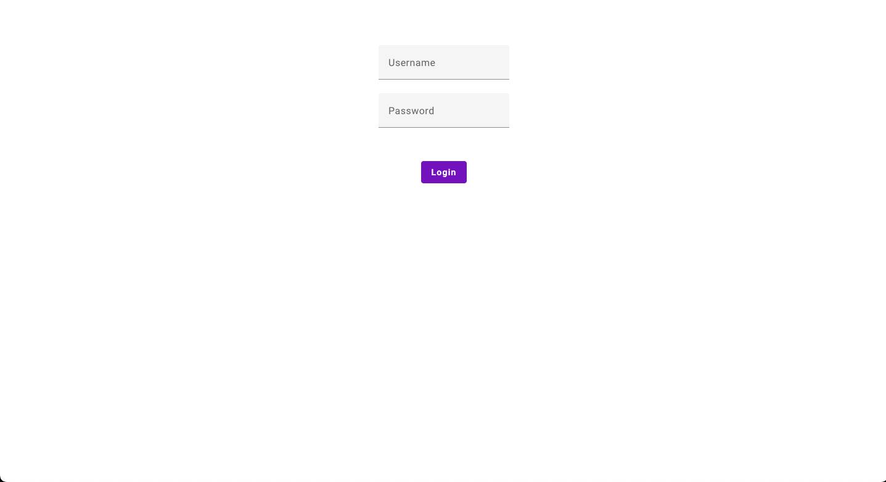
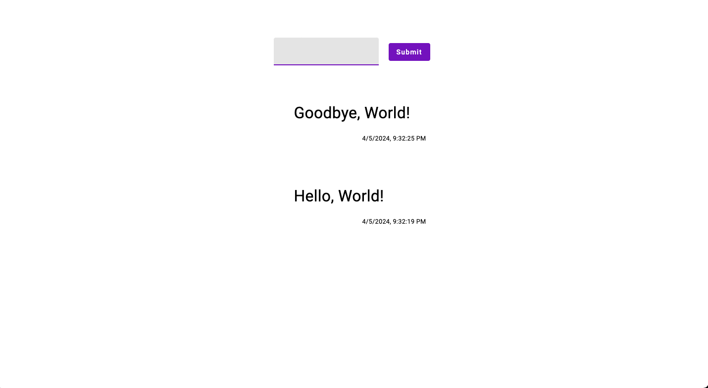

# Progress Report

During this session I successfully integrated angular material to spruce up my login form, I added a basic implementation of my timeline form and it's validation, and I added a rudimentary timeline.

## Components Added

- ContentWrapper (leverages ng-content to center and size content in my app)
- Timeline (uses the store service to load in timeline posts as well as prepend new posts from a timeline form)
- TimelinePost (displays an individual timeline post loaded as input from a parent container)

## Plan Vs Execution

Everything I set out to do in dev log 2 was accomplished almost identically as planned with the exception of the type of my postedDateTime in the TimelinePost type. I had originally planned for it to be a date and while I think that would ordinarily be the right approach, in this case, because I have no server, there's no reason for me to have the posted date time as anything other than a string, since it is display only and doesn't need to be fetched, filtered, or sorted.

One other fun thing was since I'm more familiar with older versions of angular, I had intended to use ngFor and ngIf but angular recently introduced built in control flow so I used those functions (@for and @if/@else respectively) instead.

## Login Form

## Timeline

