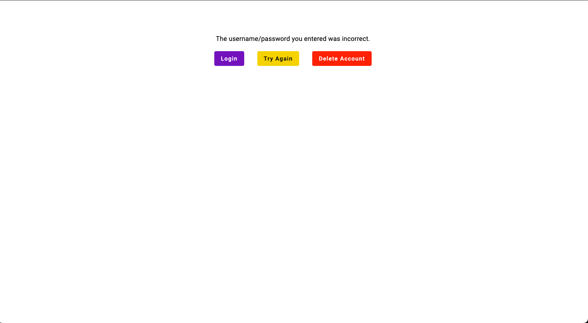

# After Action Report

Mission Accomplished!

## Components Added

- logout-form (Logout form is a bit of a misnomer at this point. It's more accurately a logout page).

## Plan Vs Execution

I was able to do everything I had set out to do in my previous log. I ended up going with the approach of checking every character for authorization every time. When you type fast, it creates a hilarious effect where the overlays stack on top of each other and make the background very black. It gets lighter as you enter your username and password more times.

## Logout Form

## Timeline

Logout functionality works beautifully. And my pranks work perfectly.

I call this an absolute win!
